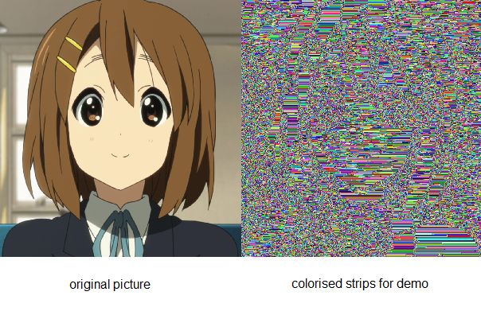

**SPF** is stripped image format that compresses images with low amount of colors (e.g a country's flag).
You can convert other image formats to **SPF** with this program, but it would be inefficient for images with million colors :D

